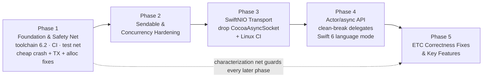

# sACNKit Modernization - Phased Roadmap

## Context

`sACNKit` is a Swift implementation of ANSI E1.31-2018 (sACN), originally ported from ETC's C
`sACN` library around its **2.0.0** release (~2022). Since then ETC has shipped **3.0.0** and,
per the upstream working tree, **4.0.0.6** (Jun 2026) - carrying a large body of spec-compliance
fixes, correctness fixes, and new features. Meanwhile sACNKit itself has drifted: it is built on a
pre-concurrency GCD + delegate model, wraps the Objective-C `CocoaAsyncSocket`, has almost no test
coverage, no CI, and at least one confirmed correctness bug in the transmit path.

The goal is a **phased, documented modernization** that (a) establishes a trustworthy foundation,
(b) migrates the transport to **SwiftNIO**, (c) rebuilds the public API around **Swift Concurrency
(actors + async/await + AsyncStream)**, and (d) folds in ETC's **correctness fixes plus high-value
features**. This document is the durable plan we execute against; each phase is independently
shippable and testable.

## Decisions (locked)

These were settled with the maintainer and are no longer open:

- **Networking:** migrate fully to **SwiftNIO** (drop CocoaAsyncSocket/Obj-C; gain Linux,
  packet-info, vectored reads).
- **Concurrency API:** **full actor + async redesign** (actors, `AsyncStream`, `async/await`,
  Swift 6 strict concurrency). Breaking changes accepted.
- **ETC alignment:** port **fixes + key features** (not a structural mirror of upstream's
  feature-mask init model).
- **Order:** **foundation first** - tooling/CI/tests/toolchain, then modernization, then the larger
  behavioral fixes land on the modern foundation. (Exception: confirmed crash-safety and the
  confirmed transmit bug are cheap and land in Phase 1 behind tests - see note in Phase 1.)
- **Platform floors:** **iOS 18 / macOS 15 / tvOS 18 / visionOS 2** (raised from iOS 17 / macOS 14 /
  tvOS 17 / visionOS 1 in Phase 4: the actor-on-NIO-loop synchronous delivery relies on
  `SerialExecutor.checkIsolated()`, which is `@available(macOS 15, iOS 18)`; see docs/modernization/phase-4.md),
  plus **Linux** (server-side
  Swift, headless nodes) as a first-class target. These floors make async/await, `AsyncStream`, and
  Swift 6 concurrency ergonomic (fewer `@available` guards) and run `swift-testing`; SwiftNIO supports
  all of them. Minimum Swift toolchain **6.2** (for `Span`/`RawSpan`/`InlineArray`; see the modern-Swift
  decision below). (watchOS is out of scope - no realistic sACN use case.) Note: these floors do **not**
  make the 6.2 `Span` bridging APIs unconditionally available (those need the 2025 OS wave, iOS 26 /
  macOS 26), so `Span` adoption is gated behind `if #available` with allocation-free fallbacks.
- **Modern Swift, memory-safe & allocation-free (layering-scoped):** prefer modern memory-safe,
  allocation-free APIs in the wire-format and buffer hot paths - the stdlib non-allocating
  `UnsafeRawBufferPointer.loadUnaligned(fromByteOffset:as:)` (adopted in Phase 1; ungated, all floors,
  Linux), with `Span`/`RawSpan` (SE-0447) and `InlineArray` (SE-0453) as optional later refinements
  behind `if #available` + a `withUnsafeBytes` fallback where the bridging accessors are OS-gated.
  **NIO `ByteBuffer` is confined to the transport layer and does not become a wire-format vocabulary
  type** - the `Layers/*` codec, `Data+Extensions`, and the internal socket-delegate payload stay
  `Data`-based, keeping a clean transport/codec boundary (see the 2026-07-15 amendment below and
  docs/modernization/phase-3.md workstream H). This aligns with the `AGENTS.md` "use modern Swift
  idioms where it doesn't hurt readability" convention.
- **Cross-platform support:** **Linux is a supported target, not just a NIO side-effect.** The library
  must build and pass tests on Linux from Phase 3 onward, and all platform-specific code paths (host
  name, monotonic clock, sockets, Obj-C runtime) must be conditionalized behind `#if canImport(...)` /
  `#if os(...)` with portable fallbacks. See "Cross-platform / portability blockers" below.
- **Test framework:** **`swift-testing`** for all new suites (`@Test`/`#expect`, parameterized cases
  suit wire-layer round-trips and merger matrices). The existing `DMPLayerTests` migrates from XCTest;
  the empty `sACNKitTests.swift` placeholder is deleted.
- **Delegate API (Phase 4):** **clean break.** All delegate protocols are removed in favor of
  `async`/`AsyncStream`. No deprecated compatibility shim.

### Amendment (2026-07-15) - wire-format codec stays `Data`; NIO stays in transport

The original "modern Swift" decision listed NIO `ByteBuffer` typed reads among the wire-format
hot-path APIs, and Phase 3 PR 2 was scoped to migrate `Layers/*` parse/build, the in-place replacers,
and the internal `ComponentSocketDelegate` payload to `ByteBuffer`. On review that coupling was judged
not worth its cost, and PR 2 is re-scoped (detail in docs/modernization/phase-3.md workstream H):

- **Layering (the priority):** `ByteBuffer` stays confined to `NIOComponentSocket` /
  `NetworkInterfaceResolver`. The codec (`Layers/*`, `Data+Extensions`, `SourceUniverse`) and the
  internal delegate payload remain `Data`. The transport/codec boundary is a maintained invariant, not
  an incidental state - a later transport swap or test double must not drag NIO through the wire format.
- **Performance:** the one measurable per-frame allocation - the `rootLayer + framingLayer + dmpLayer`
  concatenation in `sACNSource.buildDataMessages` - is removed by pre-composing **one `Data` packet per
  universe** and mutating it in place via the existing offset-based replacers. This is a data-structure
  change (kill the per-frame join), not a type change, and captures essentially all of the transmit win
  the `ByteBuffer` swap was credited with. Scalar reads are already allocation-free via the Phase 1
  stdlib `loadUnaligned`.
- **Boundary copy kept:** the PR 1 `Data(buffer:)` / `ByteBuffer(data:)` conversion at the socket edge
  stays. At worst-case target load (~45k packets/s = ~29 MB/s, roughly 0.1% of memory bandwidth) it is
  negligible; a fully zero-copy `ByteBuffer` pipeline is not justified by measured need and would cost
  the layering boundary plus the centralized absolute-`Offset` parse model (idiomatic `ByteBuffer`
  parsing is reader-index-based, a bug class the offset model avoids). Revisit only under a profiler if
  a high-density Linux-server workload demonstrates a real bottleneck.
- **`RawSpan`/`Span`:** remain an optional, purely internal refinement of the read/write helpers
  (behind `if #available`), never affecting the layer/transport boundary.
- **Regression guard:** a performance-benchmark harness is added (see the Verification strategy
  "Performance benchmarks" item) to catch *performance* regressions - allocation counts and
  build/parse throughput - independently of the correctness characterization net.

---

## Current-state findings (baseline)

**Architecture** (good bones): clean role separation - `sACNSource` (TX), `sACNReceiverRaw`
(low-level RX engine), `sACNReceiver` (= `sACNReceiverRaw` + two `sACNMerger`s: live + sampling),
`sACNReceiverGroup` (façade over `[UInt16: sACNReceiver]`), `sACNDiscoveryReceiver`, and standalone
`sACNMerger`. Wire-format layers (`Layers/RootLayer`, `DataFramingLayer`, `DMPLayer`,
`UniverseDiscovery*`) are value types with `createAsData`/`parse` + validation errors and centralized
byte offsets - the strongest part of the codebase. Public doc comments (`///`) already exist on the
layers and merger, so a DocC migration is low-friction.

**Concurrency** (dated): GCD serial queues, one per component, doubling as the state mutex
(`socketDelegateQueue.sync { … }`); user-supplied `delegateQueue`; vendored `CwlDispatch.swift`
timers (`DispatchSource.singleTimer`/`repeatingTimer`) + `MonotonicTimer` (`clock_gettime_nsec_np`).
**Zero** Swift Concurrency, **zero** `Sendable`. Reentrancy handled via `DispatchSpecificKey`
sentinels (recent deadlock fixes: commit `67e3e2b`).

**Networking:** `Shared/ComponentSocket.swift` (`class ComponentSocket: NSObject,
GCDAsyncUdpSocketDelegate`) wraps `GCDAsyncUdpSocket` (CocoaAsyncSocket 7.6.5) - the sole external
dependency; one socket per interface keyed in `[String: ComponentSocket]`. Full dual-stack
(`sACNIPMode`), multicast join/leave, reuse-port, interface bind, IPv6 egress interface
(`sendIPv6Multicast(onInterface:)`). **No** per-packet interface info; no vectored reads.

**Toolchain:** `swift-tools-version:5.5`, platforms iOS 12 / macOS 11, `Package.resolved` v1.

**Tests/CI/docs:** only `DMPLayerTests` (2 cases) + an empty `sACNKitTests.swift`; no CI; no DocC;
23-line README; no lint/format config; a stray `.swiftpm/xcode/` metadata directory.

**Portability:** the package is currently **Apple-only** and would not compile on Linux. `Package.swift`
declares only `iOS`/`macOS`. Three hard blockers plus incidental ones:
- **CocoaAsyncSocket** (Obj-C, Apple-only) is the sole dependency - the whole package fails to build on
  Linux until it is removed. **This gates Linux CI on the Phase 3 SwiftNIO migration** - no earlier.
- **`Shared/Universe/Source.swift:47-50`** - `#if os(iOS)` → `UIDevice.current.name` (UIKit),
  `#else` → `Host.current().localizedName!`. `Host` is a Darwin-only Foundation type; there is **no
  Linux branch**, so this won't compile on Linux even after NIO lands.
- **`Shared/MonotonicTimer.swift:94`** - `clock_gettime_nsec_np(CLOCK_UPTIME_RAW)`; the `_np`
  ("non-portable") API is **Darwin-only**. Linux needs `clock_gettime(CLOCK_MONOTONIC, …)` via Glibc
  (or a portable clock abstraction).
- Incidental: `ComponentSocket: NSObject` (Obj-C runtime) is removed with NIO in Phase 3; any
  `import Foundation` networking use on Linux requires `#if canImport(FoundationNetworking)`.

### Confirmed defects (verified in code)
- **TX index-mapping bug - `Source/sACNSource.swift:869-870`.** `sendDataMessages()` filters
  `let activeUniverses = universes.filter { !$0.shouldTerminate || $0.dirtyCounter > 0 }` (`:813`),
  then iterates `for (index, _) in activeUniverses.enumerated()` (`:869`) but reads `universes[index]`
  (`:870`) - indexing the **full** array with the **filtered** index. When any universe is
  present-but-inactive (after `shouldOutput(false)`, or mid-termination), it processes the wrong
  universes and drops the tail. Should iterate `activeUniverses` directly. **Correctness bug.**
- **Force-unwraps (crash paths):** `Shared/Universe/Source.swift:50` `Host.current().localizedName!`
  (nil on headless/sandboxed macOS); `Receiver/sACNReceiver.swift:120` and
  `Receiver/sACNReceiverGroup.swift:135` force-unwrap a failable `init(...)!`.
- **Receiver delegate deadlock window** *(fixed in Phase 2)*: `sACNReceiverRaw.processDataPacket`
  delivered via `delegateQueue.sync` while holding `socketDelegateQueue`; a client calling back into
  the receiver from within a callback could AB/BA deadlock. Delivery is now `.async`, like TX.
- **Undocumented serial-queue requirement** *(fixed in Phase 2)*: `sACNReceiver`/`sACNReceiverGroup`
  mutated state with no lock of their own - safe only if the client's `delegateQueue` was serial.
  Both now serialize state on internal queues.
- **Stale per-packet priority on clear** *(fixed in Phase 3 PR 2)*: clearing a universe's per-packet
  priority (`sACNSourceUniverse.priority` non-nil -> nil via `updateLevels(with:)`) left the previous
  priority on the wire instead of reverting to the source priority - `SourceUniverse.update(with:)`
  only wrote the framing priority byte when the new value was non-nil. **Wire-observable behavior
  delta** (documented here, landed with the transmit refactor rather than deferred to Phase 5):
  `update(with:)` now takes `sourcePriority` and writes the effective priority (`universe.priority ??
  sourcePriority`) into both composed packets on every change. Regression-tested in `SourceTransmitTests`.
- **Mutable "constants":** `Shared/DMX/DMX.swift:33` `public static var addressCount`; multicast
  prefix statics in `NetworkDefinitions.swift:81,104` are `var` (read-only in practice) - should be `let`.
- **Hot-path allocation:** `Shared/Data+Extensions.swift` `loadUnaligned` (`:246`, per-call heap
  `UnsafeMutablePointer.allocate`) and `toUUID` (`:72`, growing `[UInt8]` + `NSUUID`) allocate per
  scalar read (per CID, per packet, up to 44 fps × N universes).
- **Duplication:** `updateInterfaces` bodies are ~85% shared across `sACNSource` (~`:325-430`),
  `sACNReceiverRaw` (~`:281-371`), `sACNDiscoveryReceiver` (~`:212-281`), with real per-component
  divergence (source tracks `socketsShouldTerminate`; raw-receiver drives `socketsSampling` +
  `beginSamplingPeriod()`). Dead `newSocketIds` collection lingers in `sACNSource.swift:416,420`.

### Upstream ETC delta to port (2.0.0 → 4.0.0.6)
> Note: upstream is at **4.0.0.6**, not 3.0.0; its CHANGELOG is stale past 3.0.0, so 3.1.0/4.0.0
> changes were reconstructed from git. See the fix/feature inventory at the end of this doc.

Highlights: source **sequence-number** fix; universe-discovery **reserved-field + sorted-list** fixes
& detector accepting **<40-universe** pages; **redundant multicast send** fix; **flicker after
sampling** + **network-reset re-samples only new interfaces**; **DMX merger order-independence** and
PAP correctness (`per_address_priorities_active` when PAP==universe priority; remove-then-add-PAP);
**handle wrapping**; **separate PAP keep-alive** interval; richer **merge-receiver callbacks** +
per-source priority data; receiver data model exposing **`sequence`/`options`/`sync_universe`**.

---

## Phased Roadmap

Each phase is independently shippable; the Phase 1 characterization net guards every later phase
against regressions.

### Phase 1 - Foundation & Safety Net
**Goal:** modern toolchain, CI, and a regression test net that captures *current* behavior before any
rewrite - plus the cheap crash-safety and confirmed-bug fixes.

- **Toolchain:** bump `swift-tools-version` to 6.0 and require the **Swift 6.2 toolchain** to build
  (for `Span`/`InlineArray`); declare platforms **iOS 17 / macOS 14 / tvOS 17 / visionOS 1** (later raised
  to iOS 18 / macOS 15 / tvOS 18 / visionOS 2 in Phase 4) (Linux
  needs no `platforms` entry - it's implicit once the Obj-C dependency is gone in Phase 3); regenerate
  `Package.resolved`; delete the stray `.swiftpm/xcode/…` metadata and gitignore `.swiftpm/`.
- **Cross-platform prep (non-socket Darwin APIs):** conditionalize the two Darwin-only code paths that
  don't depend on the socket layer, so Linux "just compiles" the moment CocoaAsyncSocket is removed in
  Phase 3: (a) `Shared/Universe/Source.swift` host name - add a Linux branch
  (`ProcessInfo.processInfo.hostName`, or Glibc `gethostname`) alongside the iOS/macOS branches, folded
  into the force-unwrap fix below; (b) `Shared/MonotonicTimer.swift` - replace `clock_gettime_nsec_np`
  with a portable clock (`#if canImport(Darwin)` uses the `_np` form, `#else` uses Glibc
  `clock_gettime(CLOCK_MONOTONIC, …)`), guarded by a monotonic-clock test. These compile-guard cleanly
  on Apple today and are validated on Linux in Phase 3.
- **CI:** GitHub Actions - build + test on macOS (Linux added in Phase 3). Add a `swift-format`
  config + a format-check job.
- **Characterization tests** (the net, in **`swift-testing`**): round-trip build/parse tests for every
  wire layer (`Layers/*` - migrate and extend the existing `DMPLayerTests`, delete the empty
  `sACNKitTests.swift`); a full `sACNMerger` suite (HTP/priority/PAP winner recalculation - currently
  0 coverage); and a **transmit/termination state-machine harness** driving `SourceUniverse` flag
  combinations and asserting emitted packets (3 termination packets, sequence increments, keep-alive
  cadence). Capture behavior as-is; failures found here become Phase 5 fixes.
- **Docs:** DocC catalog scaffold (doc comments already exist and migrate cleanly); expand README
  (install, requirements, usage per public type); add CONTRIBUTING + link this roadmap.
- **Cheap fixes behind tests** (crash-safety + confirmed bug - do *not* defer known crashes/data-loss
  across a multi-phase rewrite): fix `sendDataMessages` indexing (`sACNSource.swift:869-870`); replace
  the 3 force-unwraps with graceful fallbacks; make `DMX.addressCount` + multicast statics `let`;
  remove dead `newSocketIds`; fix doc/comment defects & typos.
- **Hot-path allocation quick win (no floor needed):** replace the custom allocating `loadUnaligned`
  (`Shared/Data+Extensions.swift:246`, per-call `UnsafeMutablePointer.allocate`) and `toUUID:72` with
  the stdlib non-allocating `loadUnaligned(fromByteOffset:as:)` (SE-0349, Swift 5.7+) on the
  `UnsafeRawBufferPointer` from `withUnsafeBytes` (available at all floors, no `#available` needed).
  Guard with a parse round-trip benchmark/test. Broader `RawSpan`/`InlineArray`
  adoption (behind `if #available`) lands in Phases 3-4 - see the modern-Swift decision.
- **Optional cleanup (may defer to Phase 2/3):** dedup `updateInterfaces` into a **shared helper with
  per-component hooks** (closures for the sampling/termination divergence) rather than a naive
  extract. Touches live behavior, so only do it under the new tests; otherwise defer to when these
  types are reworked anyway.

**Deliverable:** green CI on macOS, meaningful coverage of layers + merger + TX state machine, no
intended behavior change beyond crash-safety and the one confirmed TX correctness fix.

**Key files:** `Package.swift`, `Package.resolved`, `.github/workflows/*`, `.swift-format`,
`.gitignore`, `Tests/sACNKitTests/*` (new `swift-testing` suites), `Sources/.../sACNSource.swift`,
`Shared/Universe/Source.swift`, `Shared/DMX/DMX.swift`, `Shared/Definitions/NetworkDefinitions.swift`,
`README.md`, DocC catalog.

---

### Phase 2 - Concurrency Hardening & Sendability (redesign prep)
**Goal:** make the data model `Sendable`-clean and close the known concurrency-safety gaps *before*
the actor migration, so the migration is incremental rather than a big-bang.

> **Status: complete** - see docs/modernization/phase-2.md for the executed plan and completion
> notes (including the strict-concurrency recon inventory that seeds Phase 4). Notable findings
> during execution: a previously undocumented defect - the PAP-lost callback was delivered directly
> on the internal socket queue (`ReceiverRawSource.notifyPerAddressLost`) - now fixed; and `Error`
> already refines `Sendable` (SE-0302), so delegate `Error?` parameters were never a blocker.

- Enable strict concurrency checking incrementally via `swiftSettings`
  (`.enableUpcomingFeature`/`StrictConcurrency` at `.minimal`→`.targeted`).
- Adopt `Sendable` on value-type DTOs and models: `sACNSourceUniverse`, universe/priority/DMX types
  (`Shared/Universe/*`, `Shared/DMX/*`), `sACNReceiverMergedData`, `sACNReceiverSource`,
  `sACNReceiverRawSourceData`, layer structs.
- Fix confirmed concurrency correctness issues: the `sACNReceiverRaw:642` `delegateQueue.sync`
  reentrancy-deadlock window (align RX with TX's `.async` delivery, or document + guard); enforce or
  internally lock the serial-`delegateQueue` assumption in `sACNReceiver`/`sACNReceiverGroup`.

**Deliverable:** value model is `Sendable`; strict-concurrency warnings triaged; no cross-queue
deadlock or documented-only-safe races remain. Still delegate/GCD-based externally.

**Key files:** `Package.swift` (swiftSettings), `Shared/**`, `Receiver/Delegate/**`,
`Receiver/sACNReceiverRaw.swift`, `Receiver/sACNReceiver.swift`, `Receiver/sACNReceiverGroup.swift`.

---

### Phase 3 - SwiftNIO Transport Migration
**Goal:** replace CocoaAsyncSocket with SwiftNIO **beneath a stable internal socket abstraction**,
keeping the existing (delegate) API working via adapters so this phase is behavior-preserving and the
Phase 1 net still applies.

- Introduce a `protocol` socket abstraction mirroring `ComponentSocket`'s surface (bind/join/leave/
  send/receive, reuse-addr, IPv6 egress interface). Implement with NIO `DatagramBootstrap` +
  `AddressedEnvelope<ByteBuffer>`; use `MulticastChannel.joinGroup/leaveGroup`.
- Resolve interface name/IP strings → `NIONetworkDevice` (new plumbing the current design doesn't need).
- Map socket options: `SO_REUSEADDR`/`SO_REUSEPORT`, `IPV6_MULTICAST_IF`, bind semantics
  (transmit→host/port, receive→`0.0.0.0`/`::` all-interfaces).
- Add dependency `swift-nio`; remove `CocoaAsyncSocket` + the `NSObject`/`GCDAsyncUdpSocketDelegate`
  conformance. **Timers stay:** the vendored `CwlDispatch.swift` GCD timers are **deferred to Phase 4**
  (libdispatch is portable, so they are not a Linux blocker; the async redesign deletes them wholesale,
  avoiding churning the just-hardened timer plumbing twice). See docs/modernization/phase-3.md.
- **Transmit allocation win on `Data` (amended 2026-07-15):** the `Layers/*` codec stays `Data`-based
  and NIO `ByteBuffer` does not enter the wire format (see the Decisions amendment above). PR 2 instead
  removes the per-frame `rootLayer + framingLayer + dmpLayer` concatenation by pre-composing one `Data`
  packet per universe and mutating it in place with the existing offset-based replacers. The socket-edge
  `ByteBuffer <-> Data` conversion from PR 1 stays. **Staged as PR 2 within the phase**, behind the
  Phase 1 round-trip net and the new performance-benchmark guard.
- **Cross-platform validation (now unblocked):** add **Linux** to the CI matrix (build + full test
  suite on Ubuntu). The Phase 1 conditionalized paths (host name, monotonic clock) are **already
  discharged** - `Shared/Universe/Source.swift` has a portable host-name fallback and no Foundation
  networking types are used outside Darwin guards, so no `#if canImport(FoundationNetworking)` is
  needed. Confirm NIO multicast join/leave, reuse-addr, and IPv6 egress interface behave on Linux
  (epoll) as on Apple (kqueue); IPv4 multicast egress is the one open question (risk R5 in phase-3.md).
- **Extended platforms (best-effort, stretch):** **Android** and **Windows** are secondary coverage
  goals NIO makes reachable (see the Android note in the platform matrix below). Add compile-only CI
  for them where the toolchain allows; do not block the phase on green runtime tests there.
- Optional upgrades enabled by NIO (schedule as follow-ups if time-boxed): per-packet interface info
  (`receivePacketInfo`) for multi-homed multicast dedup; vectored reads for high-universe-count RX.

**Deliverable:** all transport on SwiftNIO; CocoaAsyncSocket removed (`CwlDispatch.swift` remains until
Phase 4); **macOS CI green and blocking; Linux CI runs non-blocking and does not yet build** (three
causes - see the Status note; Android/Windows deferred as follow-ups); existing delegate API unchanged,
except three documented behavior deltas (ipMode-enforced families, scoped-IPv6 hostname format, no
callback on clean close - see docs/modernization/phase-3.md).

> **Status: complete** - PR 1 (transport swap) + PR 2 (transmit allocation win), merged as #43.
> `ComponentSocket` protocol + `NIOComponentSocket` + `NetworkInterfaceResolver`, CocoaAsyncSocket
> removed. Honest-history deviations from the plan (phase-2.md precedent):
>
> - **Behavior deltas B-1..B-3 shipped as specified:** ipMode-enforced families, scoped link-local
>   IPv6 hostname format, no delegate callback on clean close. Two public error cases
>   (`couldNotReceive`, `couldNotEnablePortReuse`) are preserved as API but now unreachable.
> - **PR 2 (amended 2026-07-15):** the wire-format codec stays `Data`; NIO `ByteBuffer` is confined to
>   the transport. The per-frame packet concatenation is gone - one pre-composed `Data` packet per
>   universe, mutated in place. A pre-existing **stale per-packet priority on clear** bug was fixed
>   here (a wire-observable delta - see the confirmed-defects list) with a regression test.
> - **R6 resolved:** the facade Sendability fallback was taken - `@unchecked Sendable` on
>   `NIOComponentSocket` only, with all mutable state behind one `NIOLockedValueBox` and a weak
>   delegate; TSan-guarded.
> - **R5 open:** Linux IPv4 multicast egress is unverified. IPv6 and multicast delivery have **no
>   runtime coverage** on the Linux runner, so this is untested, not confirmed working. To be settled
>   on real Linux hardware; if egress is implicated, set `IP_MULTICAST_IF` on v4 transmit channels.
> - **`isFatal` broader than planned (deliberate):** `NIOComponentSocket.isFatal` also treats
>   `ECONNREFUSED`/`EHOSTUNREACH`/`ENETUNREACH`/`EHOSTDOWN`/`ENETDOWN`/`ECONNRESET`/`EMSGSIZE` as
>   non-fatal (beyond the plan's `EWOULDBLOCK`/`EAGAIN`/`EINTR`), so one unreachable unicast
>   destination cannot tear down a socket serving every universe. Correct for unconnected UDP.
> - **Portability discharged:** `MonotonicTimer` cross-platform clock (Darwin `CLOCK_UPTIME_RAW` /
>   Glibc `CLOCK_MONOTONIC`); host-name fallback already in place.
>
> **Linux CI is known-not-green.** The `Build & Test (Linux)` job is **non-blocking** and currently
> fails to build. Three causes: (1) Swift 6 concurrency-capture diagnostics across the GCD/delegate
> stack (promoted to errors by warnings-as-errors) and (2) Darwin-only `NSEC_*` symbols in vendored
> `CwlDispatch` - both **dissolved by Phase 4** (actor/async redesign + CwlDispatch removal); plus (3)
> a `CInt`/`Int` IPv6-socket-option mismatch in `NIOComponentSocket` that Phase 4 does **not** fix (the
> NIO transport is retained), so land it independently. Only the ~110 non-network logic tests gate
> merges today. See docs/modernization/phase-3.md for the executed plan.

**Key files:** `Shared/ComponentSocket.swift` (protocol), `Shared/NIOComponentSocket.swift` (new),
`Shared/NetworkInterfaceResolver.swift` (new), `Shared/MonotonicTimer.swift`, `Package.swift`,
`.github/workflows/*`.

---

### Phase 4 - Swift Concurrency API Redesign (actors + async)
**Goal:** rebuild the public API around Swift Concurrency; adopt Swift 6 language mode fully. Breaking.

> **Status: complete** - see docs/modernization/phase-4.md. Every component is a Swift `actor` on a custom
> event-loop executor with an `async` API + `AsyncStream` output (PR2-PR4); PR5 turned on **Swift 6 language
> mode** (`swiftLanguageModes: [.v6]`, default isolation left `nonisolated`, `NonisolatedNonsendingByDefault` +
> `InferIsolatedConformances`), deleted `Vendor/CwlDispatch.swift` and the socket's legacy GCD path, and
> promoted the Linux `Build & Test` CI job to blocking.

- Convert core components (`sACNSource`, `sACNReceiver`, `sACNReceiverGroup`,
  `sACNDiscoveryReceiver`, `sACNMerger`) to **actors** (or NIO `EventLoop`-isolated types), removing
  the queue-as-mutex pattern and the mandatory `delegateQueue` init parameter.
- Public **`async`/`await`** lifecycle (`start`/`stop`/`update…`/universe & level mutation).
- **Clean break:** remove all 7 delegate protocols (`Receiver/Delegate/**`,
  `Source/sACNSourceDelegate.swift`, and the shared error/debug delegates in
  `Shared/sACNComponent.swift`) and replace them with **`AsyncStream`/`AsyncSequence`** event streams
  (inbound universe data, merged data, source-loss, sampling started/ended, discovery updates,
  errors). No deprecated shim is shipped.
- Turn on Swift 6 language mode; resolve remaining `Sendable`/isolation diagnostics.
- Replace GCD/`DispatchSourceTimer` timing with async timing (`Task.sleep` / `ContinuousClock` /
  NIO scheduled tasks), and **remove the vendored `Vendor/CwlDispatch.swift`** (deferred here from
  Phase 3). Also remove the Phase 2 `process(data:)` receiver test-seam shim kept through Phase 3.
- **Modern memory-safe types (behind `if #available`):** adopt `RawSpan`/`Span` in the `Data`-based
  layer/parse code (all of it - the codec never moved to `ByteBuffer`; see the Decisions amendment) and
  evaluate `InlineArray` for the fixed 512-slot DMX level/priority buffers, with the `withUnsafeBytes` +
  stdlib `loadUnaligned` fallback where the floor lacks the API. Keep readability first per the
  `AGENTS.md` convention.

**Deliverable:** modern async-first public API; Swift 6 language mode clean; delegates removed. This
is the major-version boundary.

**Key files:** every public type under `Source/`, `Receiver/`, `Merger/`; `Receiver/Delegate/**`
and `Source/sACNSourceDelegate.swift` (removed); `Shared/sACNComponent.swift`; `Package.swift`
(`swiftLanguageModes`).

---

### Phase 5 - ETC Correctness Fixes & Key Features (on the modern foundation)
**Goal:** port ETC's behavioral spec/correctness fixes and high-value features, each guarded by the
Phase 1 net (now running on the modern stack). See the inventory below for the full list.

> **Status: complete** - see docs/modernization/phase-5.md. Shipped as five PRs: PR1 merger correctness
> (SACN-403 PAP-revert family + order-independence + SACN-364), PR2 receiver data model (sequence / options /
> sync universe, SACN-392), PR3 richer merge callbacks + per-source priority + the `perAddressPriorityLost`
> event, PR4 ETC-aligned configurable keep-alive intervals (800 ms NULL / 1000 ms PAP), and PR5 regression
> lock-in for the already-correct items. Validated against ETCLabs/sACN v4.0.0.6; the characterization-first
> discipline caught five latent bugs that predated the modernization.

- **Spec/on-wire fixes:** source sequence numbering; universe-discovery reserved-field write + sorted
  universe list; discovery detector accepting <40-universe pages; eliminate redundant multicast sends.
  *Reuse existing plumbing:* `DataFramingLayer` already exposes in-place data-extension replacers for
  `sequenceNumber`/`options`/`priority`, and `SourceUniverse` owns `sequence` (`&+=`), `dirtyCounter`,
  `dirtyPriority`, and the 3-packet termination model - the sequence/on-wire fixes hook into these
  rather than reworking layer construction.
- **Receiver behavior:** flicker after the sampling period; network reset re-samples only *new*
  interfaces (`is_sampling` per source); sampling-exclusion-on-init fix. *Note:* sACNKit's local
  contribution to post-sampling flicker (an inverted condition in `sACNReceiver.samplingEnded` that
  dropped sampling-captured per-address priorities) was already fixed in the Phase 2 post-review
  addendum (docs/modernization/phase-2.md); the ETC port here covers the remaining upstream
  behavior, not that flip.
- **Merger correctness:** output independent of input order; `perAddressPrioritiesActive` correct when
  PAP == universe priority; remove-PAP-then-add-PAP sequencing.
- **Robustness:** remote-source / merger-source handle wrapping/rollover at `0xFFFF`.
- **Features:** separate **PAP keep-alive** interval; **richer merge-receiver callbacks** + per-source
  priority data; expose received **`sequence`, `options`, `sync_universe`** on receiver data (fits
  naturally in the new AsyncStream payloads). *Right-sizing note:* `sACNMerger` already tracks
  `perAddressPrioritiesActive` and `universePriority` internally (and `MergerSource` tracks
  `usingUniversePriority`/`addressPriorities`), so "richer callbacks + per-source priority data" is
  largely **surfacing existing internal state** through the new payloads, not net-new merge logic.

**Deliverable:** behavior matches ETC 3.0.0/4.0.0 for the ported items, each with a regression test.

**Key files:** `Source/sACNSource.swift`, `Source/SourceUniverse.swift`,
`Layers/UniverseDiscoveryLayer.swift`, `Layers/UniverseDiscoveryFramingLayer.swift`,
`Receiver/sACNReceiverRaw.swift`, `Receiver/sACNReceiver.swift`, `Merger/sACNMerger.swift`,
`Merger/MergerSource.swift`, receiver data-model types.

---

## Verification strategy
- **Unit/characterization tests** (Phase 1 onward): wire-layer round-trips, merger winner
  recalculation, TX termination/keep-alive state machine. Run in CI on macOS + (from Phase 3) Linux,
  per the platform support matrix below.
- **Loopback integration tests:** a `sACNSource` transmitting to a `sACNReceiver`/`sACNReceiverGroup`
  on localhost multicast - assert received levels/priority/sampling/source-loss transitions end to end.
- **Interop spot-checks (manual):** validate on-wire packets against the E1.31 spec and against ETC's
  reference behavior where feasible (e.g. Wireshark capture of sequence numbers, discovery packet
  sorting/reserved field, 3× termination packets). Compare merger output to ETC `dmx_merger` for
  representative PAP/HTP cases.
- **Performance benchmarks (regression guard, not correctness):** a benchmark harness measuring
  wire-format hot paths - data-packet parse, `buildDataMessages` at representative universe counts
  (1 / 64 / 256, dual-stack), and the in-place replacers - with **allocation counts as the primary,
  deterministic signal** and wall-clock as secondary. Its purpose is catching *performance* regressions
  (e.g. a reintroduced per-frame allocation), separate from the correctness net. The baseline is
  established alongside the re-scoped Phase 3 PR 2 (which removes the per-frame concatenation) so the win
  is measured, not assumed. Runs in CI as a **non-blocking** tracking job (shared-runner wall-clock is
  noisy); allocation-count assertions are the hard gate where deterministic. See
  docs/modernization/phase-3.md workstream J.
- **Per-phase gate:** each phase merges only with green CI and no regression in the characterization net.

---

## Platform support matrix

| Platform | Tier | Floor | Enabled by | Notes |
|---|---|---|---|---|
| macOS | Primary | 15 | Phase 1 (raise to 14), Phase 4 (raise to 15) | Full test + runtime CI. |
| iOS | Primary | 18 | Phase 1 (raise to 17), Phase 4 (raise to 18) | Full support; runtime CI via simulator. |
| tvOS | Primary | 18 | Phase 1 (declare 17), Phase 4 (raise to 18) | Same code path as iOS. |
| visionOS | Primary | 2 | Phase 1 (declare 1), Phase 4 (raise to 2) | Same code path as iOS. |
| Linux | Primary | Swift 6.2 | **Phase 3** (NIO removes Obj-C dep) | Build + full test CI (Ubuntu). Gated on CocoaAsyncSocket removal. |
| Android | Stretch | Swift 6.2 + Android SDK | **Phase 3** (NIO) | See note below - NIO runs (epoll), but multicast **receive** needs an app-side `WifiManager.MulticastLock`. Compile-check in CI. |
| Windows | Stretch | Swift 6.2 | **Phase 3** (NIO) | NIO supports Windows; compile-check in CI, no guaranteed runtime tests. |
| watchOS | Out of scope | - | - | No realistic sACN use case. |

> Floors are iOS 18 / macOS 15 / tvOS 18 / visionOS 2 (raised from 17/14/17/1 in Phase 4 - see below).
> These do **not** unconditionally unlock the Swift 6.2 `Span` bridging APIs (those need the 2025 OS
> wave: iOS 26 / macOS 26), so `Span`/`RawSpan` adoption is gated behind `if #available` with
> allocation-free fallbacks. Toolchain floor is Swift 6.2.

**Android note.** SwiftNIO *can* run on Android: Android is a Linux kernel, so NIOPosix's `epoll`
backend works, NIO carries `os(Android)` compile guards, and the Swift Android Workgroup +
`swift-android-sdk` make the toolchain viable (secondary support tier, needs its own testing). Two
practical caveats specific to an sACN library - both **integration/runtime**, not code we control:
1. **Multicast receive requires a `MulticastLock`.** Android's Wi-Fi stack filters inbound multicast
   by default; the *host app* must acquire and hold `WifiManager.MulticastLock` (Java/Kotlin) while a
   receiver is listening, or no sACN packets arrive. This is documented as a host-app requirement, not
   something the Swift library can satisfy alone.
2. **NIC/interface enumeration and Foundation coverage** are thinner on Android; interface-name →
   device resolution (Phase 3) and host-name lookup (Phase 1) need Android-specific validation.
   Because of this, Android is a **best-effort stretch target** (compile-checked in CI) rather than a
   guaranteed-runtime tier.

---

## Appendix - ETC fix/feature inventory (source of truth for Phase 5)

**Spec compliance / on-wire**
- Source sequence numbers corrected (3.0.0).
- Universe discovery: reserved-field write fixed; universe list sorted ascending (3.0.0); detector no
  longer discards pages with <40 universes (2.0.2).
- Redundant multicast sends removed (3.0.0).

**Receiver / sampling**
- Flicker after sampling period fixed; network reset re-samples only new interfaces (3.0.0).
  (sACNKit's local `samplingEnded` PAP-transfer inversion is already fixed - see the Phase 2
  post-review addendum - so this item is the upstream behavior only.)
- Sources no longer excluded from sampling during init (3.0.0).
- Receiver data model gains `sync_universe`, `sequence`, `options` (SACN-392, 4.0.0).

**DMX merger**
- Output made independent of level/priority input order (3.0.0).
- `per_address_priorities_active` correct when PAP == universe priority (SACN-364).
- remove-PAP-then-add-PAP produces correct PAPs (SACN-403).
- Merge-receiver: richer callbacks + per-source `per_address_priorities_active` / `universe_priority`
  (3.0.0).

**Robustness / resources**
- Remote-source & merger-source handle wrapping/rollover (3.0.0).
- Unicast sockets reset to INVALID after close (SACN-390).
- Memory-leak/resource audit fixes (3.0.0).

**Configurability (adopt where they fit the Swift API)**
- Separate PAP keep-alive interval (default 1000 ms vs 800 ms levels).
- Send-timeout / buffer-size socket options (evaluate under NIO in Phase 3).

**Explicitly out of scope** (per "fixes + key features", not "track ETC closely"): mirroring ETC's
4.0.0 **feature-mask init model** (`sacn_init_features`, redundant-init) and static-memory-mode
options - noted for future reference only.
