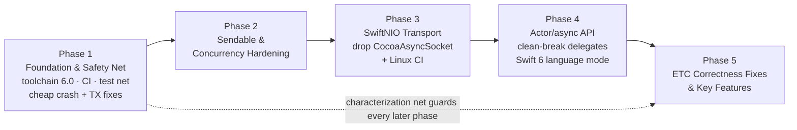

# sACNKit Modernization — Phased Roadmap

## Context

`sACNKit` is a Swift implementation of ANSI E1.31-2018 (sACN), originally ported from ETC's C
`sACN` library around its **2.0.0** release (~2022). Since then ETC has shipped **3.0.0** and,
per the upstream working tree, **4.0.0.6** (Jun 2026) — carrying a large body of spec-compliance
fixes, correctness fixes, and new features. Meanwhile sACNKit itself has drifted: it is built on a
pre-concurrency GCD + delegate model, wraps the Objective-C `CocoaAsyncSocket`, has almost no test
coverage, no CI, and at least one confirmed correctness bug in the transmit path.

The goal is a **phased, documented modernization** that (a) establishes a trustworthy foundation,
(b) migrates the transport to **SwiftNIO**, (c) rebuilds the public API around **Swift Concurrency
(actors + async/await + AsyncStream)**, and (d) folds in ETC's **correctness fixes plus high-value
features**. This document is the durable plan we execute against; each phase is independently
shippable and testable.

## Decisions (locked)

These were settled with the maintainer and are no longer open:

- **Networking:** migrate fully to **SwiftNIO** (drop CocoaAsyncSocket/Obj-C; gain Linux,
  packet-info, vectored reads).
- **Concurrency API:** **full actor + async redesign** (actors, `AsyncStream`, `async/await`,
  Swift 6 strict concurrency). Breaking changes accepted.
- **ETC alignment:** port **fixes + key features** (not a structural mirror of upstream's
  feature-mask init model).
- **Order:** **foundation first** — tooling/CI/tests/toolchain, then modernization, then the larger
  behavioral fixes land on the modern foundation. (Exception: confirmed crash-safety and the
  confirmed transmit bug are cheap and land in Phase 1 behind tests — see note in Phase 1.)
- **Platform floors:** **iOS 15 / macOS 12.** High enough to make async/await, `AsyncStream`, and
  Swift 6 concurrency ergonomic (fewer `@available` guards) and to run `swift-testing`; SwiftNIO is
  comfortably supported.
- **Test framework:** **`swift-testing`** for all new suites (`@Test`/`#expect`, parameterized cases
  suit wire-layer round-trips and merger matrices). The existing `DMPLayerTests` migrates from XCTest;
  the empty `sACNKitTests.swift` placeholder is deleted.
- **Delegate API (Phase 4):** **clean break.** All delegate protocols are removed in favor of
  `async`/`AsyncStream`. No deprecated compatibility shim.

---

## Current-state findings (baseline)

**Architecture** (good bones): clean role separation — `sACNSource` (TX), `sACNReceiverRaw`
(low-level RX engine), `sACNReceiver` (= `sACNReceiverRaw` + two `sACNMerger`s: live + sampling),
`sACNReceiverGroup` (façade over `[UInt16: sACNReceiver]`), `sACNDiscoveryReceiver`, and standalone
`sACNMerger`. Wire-format layers (`Layers/RootLayer`, `DataFramingLayer`, `DMPLayer`,
`UniverseDiscovery*`) are value types with `createAsData`/`parse` + validation errors and centralized
byte offsets — the strongest part of the codebase. Public doc comments (`///`) already exist on the
layers and merger, so a DocC migration is low-friction.

**Concurrency** (dated): GCD serial queues, one per component, doubling as the state mutex
(`socketDelegateQueue.sync { … }`); user-supplied `delegateQueue`; vendored `CwlDispatch.swift`
timers (`DispatchSource.singleTimer`/`repeatingTimer`) + `MonotonicTimer` (`clock_gettime_nsec_np`).
**Zero** Swift Concurrency, **zero** `Sendable`. Reentrancy handled via `DispatchSpecificKey`
sentinels (recent deadlock fixes: commit `67e3e2b`).

**Networking:** `Shared/ComponentSocket.swift` (`class ComponentSocket: NSObject,
GCDAsyncUdpSocketDelegate`) wraps `GCDAsyncUdpSocket` (CocoaAsyncSocket 7.6.5) — the sole external
dependency; one socket per interface keyed in `[String: ComponentSocket]`. Full dual-stack
(`sACNIPMode`), multicast join/leave, reuse-port, interface bind, IPv6 egress interface
(`sendIPv6Multicast(onInterface:)`). **No** per-packet interface info; no vectored reads.

**Toolchain:** `swift-tools-version:5.5`, platforms iOS 12 / macOS 11, `Package.resolved` v1.

**Tests/CI/docs:** only `DMPLayerTests` (2 cases) + an empty `sACNKitTests.swift`; no CI; no DocC;
23-line README; no lint/format config; a stray `.swiftpm/xcode/` metadata directory.

### Confirmed defects (verified in code)
- **TX index-mapping bug — `Source/sACNSource.swift:869-870`.** `sendDataMessages()` filters
  `let activeUniverses = universes.filter { !$0.shouldTerminate || $0.dirtyCounter > 0 }` (`:813`),
  then iterates `for (index, _) in activeUniverses.enumerated()` (`:869`) but reads `universes[index]`
  (`:870`) — indexing the **full** array with the **filtered** index. When any universe is
  present-but-inactive (after `shouldOutput(false)`, or mid-termination), it processes the wrong
  universes and drops the tail. Should iterate `activeUniverses` directly. **Correctness bug.**
- **Force-unwraps (crash paths):** `Shared/Universe/Source.swift:50` `Host.current().localizedName!`
  (nil on headless/sandboxed macOS); `Receiver/sACNReceiver.swift:120` and
  `Receiver/sACNReceiverGroup.swift:135` force-unwrap a failable `init(...)!`.
- **Receiver delegate deadlock window:** `sACNReceiverRaw.processDataPacket` delivers via
  `delegateQueue.sync` (`:642`) while holding `socketDelegateQueue`; a client calling back into the
  receiver from within a callback can AB/BA deadlock. (TX side uses `delegateQueue.async` — inconsistent.)
- **Undocumented serial-queue requirement:** `sACNReceiver`/`sACNReceiverGroup` mutate state with no
  lock of their own — safe only if the client's `delegateQueue` is serial; a concurrent queue races.
- **Mutable "constants":** `Shared/DMX/DMX.swift:33` `public static var addressCount`; multicast
  prefix statics in `NetworkDefinitions.swift:81,104` are `var` (read-only in practice) — should be `let`.
- **Hot-path allocation:** `Shared/Data+Extensions.swift` `loadUnaligned` (`:246`, per-call heap
  `UnsafeMutablePointer.allocate`) and `toUUID` (`:72`, growing `[UInt8]` + `NSUUID`) allocate per
  scalar read (per CID, per packet, up to 44 fps × N universes).
- **Duplication:** `updateInterfaces` bodies are ~85% shared across `sACNSource` (~`:325-430`),
  `sACNReceiverRaw` (~`:281-371`), `sACNDiscoveryReceiver` (~`:212-281`), with real per-component
  divergence (source tracks `socketsShouldTerminate`; raw-receiver drives `socketsSampling` +
  `beginSamplingPeriod()`). Dead `newSocketIds` collection lingers in `sACNSource.swift:416,420`.

### Upstream ETC delta to port (2.0.0 → 4.0.0.6)
> Note: upstream is at **4.0.0.6**, not 3.0.0; its CHANGELOG is stale past 3.0.0, so 3.1.0/4.0.0
> changes were reconstructed from git. See the fix/feature inventory at the end of this doc.

Highlights: source **sequence-number** fix; universe-discovery **reserved-field + sorted-list** fixes
& detector accepting **<40-universe** pages; **redundant multicast send** fix; **flicker after
sampling** + **network-reset re-samples only new interfaces**; **DMX merger order-independence** and
PAP correctness (`per_address_priorities_active` when PAP==universe priority; remove-then-add-PAP);
**handle wrapping**; **separate PAP keep-alive** interval; richer **merge-receiver callbacks** +
per-source priority data; receiver data model exposing **`sequence`/`options`/`sync_universe`**.

---

## Phased Roadmap

Each phase is independently shippable; the Phase 1 characterization net guards every later phase
against regressions.

### Phase 1 — Foundation & Safety Net
**Goal:** modern toolchain, CI, and a regression test net that captures *current* behavior before any
rewrite — plus the cheap crash-safety and confirmed-bug fixes.

- **Toolchain:** bump `swift-tools-version` to 6.0; raise platform floors to **iOS 15 / macOS 12**;
  prepare for Linux (declared later with NIO); regenerate `Package.resolved`; delete the stray
  `.swiftpm/xcode/…` metadata and gitignore `.swiftpm/`.
- **CI:** GitHub Actions — build + test on macOS (Linux added in Phase 3). Add a `swift-format`
  config + a format-check job.
- **Characterization tests** (the net, in **`swift-testing`**): round-trip build/parse tests for every
  wire layer (`Layers/*` — migrate and extend the existing `DMPLayerTests`, delete the empty
  `sACNKitTests.swift`); a full `sACNMerger` suite (HTP/priority/PAP winner recalculation — currently
  0 coverage); and a **transmit/termination state-machine harness** driving `SourceUniverse` flag
  combinations and asserting emitted packets (3 termination packets, sequence increments, keep-alive
  cadence). Capture behavior as-is; failures found here become Phase 5 fixes.
- **Docs:** DocC catalog scaffold (doc comments already exist and migrate cleanly); expand README
  (install, requirements, usage per public type); add CONTRIBUTING + link this roadmap.
- **Cheap fixes behind tests** (crash-safety + confirmed bug — do *not* defer known crashes/data-loss
  across a multi-phase rewrite): fix `sendDataMessages` indexing (`sACNSource.swift:869-870`); replace
  the 3 force-unwraps with graceful fallbacks; make `DMX.addressCount` + multicast statics `let`;
  remove dead `newSocketIds`; fix doc/comment defects & typos.
- **Optional cleanup (may defer to Phase 2/3):** dedup `updateInterfaces` into a **shared helper with
  per-component hooks** (closures for the sampling/termination divergence) rather than a naive
  extract. Touches live behavior, so only do it under the new tests; otherwise defer to when these
  types are reworked anyway.

**Deliverable:** green CI on macOS, meaningful coverage of layers + merger + TX state machine, no
intended behavior change beyond crash-safety and the one confirmed TX correctness fix.

**Key files:** `Package.swift`, `Package.resolved`, `.github/workflows/*`, `.swift-format`,
`.gitignore`, `Tests/sACNKitTests/*` (new `swift-testing` suites), `Sources/.../sACNSource.swift`,
`Shared/Universe/Source.swift`, `Shared/DMX/DMX.swift`, `Shared/Definitions/NetworkDefinitions.swift`,
`README.md`, DocC catalog.

---

### Phase 2 — Concurrency Hardening & Sendability (redesign prep)
**Goal:** make the data model `Sendable`-clean and close the known concurrency-safety gaps *before*
the actor migration, so the migration is incremental rather than a big-bang.

- Enable strict concurrency checking incrementally via `swiftSettings`
  (`.enableUpcomingFeature`/`StrictConcurrency` at `.minimal`→`.targeted`).
- Adopt `Sendable` on value-type DTOs and models: `sACNSourceUniverse`, universe/priority/DMX types
  (`Shared/Universe/*`, `Shared/DMX/*`), `sACNReceiverMergedData`, `sACNReceiverSource`,
  `sACNReceiverRawSourceData`, layer structs.
- Fix confirmed concurrency correctness issues: the `sACNReceiverRaw:642` `delegateQueue.sync`
  reentrancy-deadlock window (align RX with TX's `.async` delivery, or document + guard); enforce or
  internally lock the serial-`delegateQueue` assumption in `sACNReceiver`/`sACNReceiverGroup`.

**Deliverable:** value model is `Sendable`; strict-concurrency warnings triaged; no cross-queue
deadlock or documented-only-safe races remain. Still delegate/GCD-based externally.

**Key files:** `Package.swift` (swiftSettings), `Shared/**`, `Receiver/Delegate/**`,
`Receiver/sACNReceiverRaw.swift`, `Receiver/sACNReceiver.swift`, `Receiver/sACNReceiverGroup.swift`.

---

### Phase 3 — SwiftNIO Transport Migration
**Goal:** replace CocoaAsyncSocket with SwiftNIO **beneath a stable internal socket abstraction**,
keeping the existing (delegate) API working via adapters so this phase is behavior-preserving and the
Phase 1 net still applies.

- Introduce a `protocol` socket abstraction mirroring `ComponentSocket`'s surface (bind/join/leave/
  send/receive, reuse-addr, IPv6 egress interface). Implement with NIO `DatagramBootstrap` +
  `AddressedEnvelope<ByteBuffer>`; use `MulticastChannel.joinGroup/leaveGroup`.
- Resolve interface name/IP strings → `NIONetworkDevice` (new plumbing the current design doesn't need).
- Map socket options: `SO_REUSEADDR`/`SO_REUSEPORT`, `IPV6_MULTICAST_IF`, bind semantics
  (transmit→host/port, receive→`0.0.0.0`/`::` all-interfaces).
- Add dependency `swift-nio`; remove `CocoaAsyncSocket` + the `NSObject`/`GCDAsyncUdpSocketDelegate`
  conformance; retire vendored `CwlDispatch.swift` timers in favor of NIO `EventLoop` scheduling.
- Add **Linux** to the CI matrix (now unblocked).
- Optional upgrades enabled by NIO (schedule as follow-ups if time-boxed): per-packet interface info
  (`receivePacketInfo`) for multi-homed multicast dedup; vectored reads for high-universe-count RX.

**Deliverable:** all transport on SwiftNIO; CocoaAsyncSocket + `CwlDispatch.swift` removed; macOS +
Linux CI green; existing delegate API unchanged.

**Key files:** `Shared/ComponentSocket.swift` (→ protocol + NIO impl), `Shared/MonotonicTimer.swift`,
`Vendor/CwlDispatch.swift` (removed), `Package.swift`, `.github/workflows/*`.

---

### Phase 4 — Swift Concurrency API Redesign (actors + async)
**Goal:** rebuild the public API around Swift Concurrency; adopt Swift 6 language mode fully. Breaking.

- Convert core components (`sACNSource`, `sACNReceiver`, `sACNReceiverGroup`,
  `sACNDiscoveryReceiver`, `sACNMerger`) to **actors** (or NIO `EventLoop`-isolated types), removing
  the queue-as-mutex pattern and the mandatory `delegateQueue` init parameter.
- Public **`async`/`await`** lifecycle (`start`/`stop`/`update…`/universe & level mutation).
- **Clean break:** remove all 7 delegate protocols (`Receiver/Delegate/**`,
  `Source/sACNSourceDelegate.swift`, and the shared error/debug delegates in
  `Shared/sACNComponent.swift`) and replace them with **`AsyncStream`/`AsyncSequence`** event streams
  (inbound universe data, merged data, source-loss, sampling started/ended, discovery updates,
  errors). No deprecated shim is shipped.
- Turn on Swift 6 language mode; resolve remaining `Sendable`/isolation diagnostics.
- Replace GCD/`DispatchSourceTimer` timing with async timing (`Task.sleep` / `ContinuousClock` /
  NIO scheduled tasks).

**Deliverable:** modern async-first public API; Swift 6 language mode clean; delegates removed. This
is the major-version boundary.

**Key files:** every public type under `Source/`, `Receiver/`, `Merger/`; `Receiver/Delegate/**`
and `Source/sACNSourceDelegate.swift` (removed); `Shared/sACNComponent.swift`; `Package.swift`
(`swiftLanguageModes`).

---

### Phase 5 — ETC Correctness Fixes & Key Features (on the modern foundation)
**Goal:** port ETC's behavioral spec/correctness fixes and high-value features, each guarded by the
Phase 1 net (now running on the modern stack). See the inventory below for the full list.

- **Spec/on-wire fixes:** source sequence numbering; universe-discovery reserved-field write + sorted
  universe list; discovery detector accepting <40-universe pages; eliminate redundant multicast sends.
  *Reuse existing plumbing:* `DataFramingLayer` already exposes in-place data-extension replacers for
  `sequenceNumber`/`options`/`priority`, and `SourceUniverse` owns `sequence` (`&+=`), `dirtyCounter`,
  `dirtyPriority`, and the 3-packet termination model — the sequence/on-wire fixes hook into these
  rather than reworking layer construction.
- **Receiver behavior:** flicker after the sampling period; network reset re-samples only *new*
  interfaces (`is_sampling` per source); sampling-exclusion-on-init fix.
- **Merger correctness:** output independent of input order; `perAddressPrioritiesActive` correct when
  PAP == universe priority; remove-PAP-then-add-PAP sequencing.
- **Robustness:** remote-source / merger-source handle wrapping/rollover at `0xFFFF`.
- **Features:** separate **PAP keep-alive** interval; **richer merge-receiver callbacks** + per-source
  priority data; expose received **`sequence`, `options`, `sync_universe`** on receiver data (fits
  naturally in the new AsyncStream payloads). *Right-sizing note:* `sACNMerger` already tracks
  `perAddressPrioritiesActive` and `universePriority` internally (and `MergerSource` tracks
  `usingUniversePriority`/`addressPriorities`), so "richer callbacks + per-source priority data" is
  largely **surfacing existing internal state** through the new payloads, not net-new merge logic.

**Deliverable:** behavior matches ETC 3.0.0/4.0.0 for the ported items, each with a regression test.

**Key files:** `Source/sACNSource.swift`, `Source/SourceUniverse.swift`,
`Layers/UniverseDiscoveryLayer.swift`, `Layers/UniverseDiscoveryFramingLayer.swift`,
`Receiver/sACNReceiverRaw.swift`, `Receiver/sACNReceiver.swift`, `Merger/sACNMerger.swift`,
`Merger/MergerSource.swift`, receiver data-model types.

---

## Verification strategy
- **Unit/characterization tests** (Phase 1 onward): wire-layer round-trips, merger winner
  recalculation, TX termination/keep-alive state machine. Run in CI on macOS + (from Phase 3) Linux.
- **Loopback integration tests:** a `sACNSource` transmitting to a `sACNReceiver`/`sACNReceiverGroup`
  on localhost multicast — assert received levels/priority/sampling/source-loss transitions end to end.
- **Interop spot-checks (manual):** validate on-wire packets against the E1.31 spec and against ETC's
  reference behavior where feasible (e.g. Wireshark capture of sequence numbers, discovery packet
  sorting/reserved field, 3× termination packets). Compare merger output to ETC `dmx_merger` for
  representative PAP/HTP cases.
- **Per-phase gate:** each phase merges only with green CI and no regression in the characterization net.

---

## Appendix — ETC fix/feature inventory (source of truth for Phase 5)

**Spec compliance / on-wire**
- Source sequence numbers corrected (3.0.0).
- Universe discovery: reserved-field write fixed; universe list sorted ascending (3.0.0); detector no
  longer discards pages with <40 universes (2.0.2).
- Redundant multicast sends removed (3.0.0).

**Receiver / sampling**
- Flicker after sampling period fixed; network reset re-samples only new interfaces (3.0.0).
- Sources no longer excluded from sampling during init (3.0.0).
- Receiver data model gains `sync_universe`, `sequence`, `options` (SACN-392, 4.0.0).

**DMX merger**
- Output made independent of level/priority input order (3.0.0).
- `per_address_priorities_active` correct when PAP == universe priority (SACN-364).
- remove-PAP-then-add-PAP produces correct PAPs (SACN-403).
- Merge-receiver: richer callbacks + per-source `per_address_priorities_active` / `universe_priority`
  (3.0.0).

**Robustness / resources**
- Remote-source & merger-source handle wrapping/rollover (3.0.0).
- Unicast sockets reset to INVALID after close (SACN-390).
- Memory-leak/resource audit fixes (3.0.0).

**Configurability (adopt where they fit the Swift API)**
- Separate PAP keep-alive interval (default 1000 ms vs 800 ms levels).
- Send-timeout / buffer-size socket options (evaluate under NIO in Phase 3).

**Explicitly out of scope** (per "fixes + key features", not "track ETC closely"): mirroring ETC's
4.0.0 **feature-mask init model** (`sacn_init_features`, redundant-init) and static-memory-mode
options — noted for future reference only.
